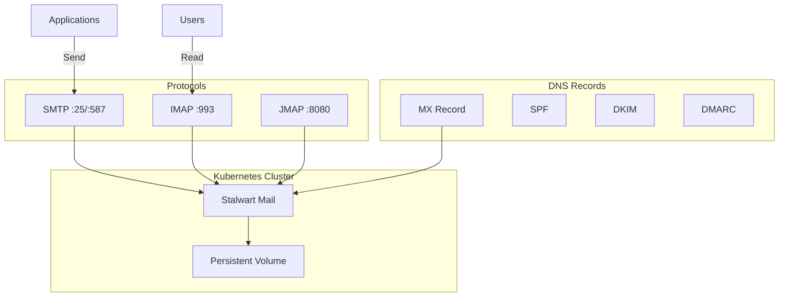
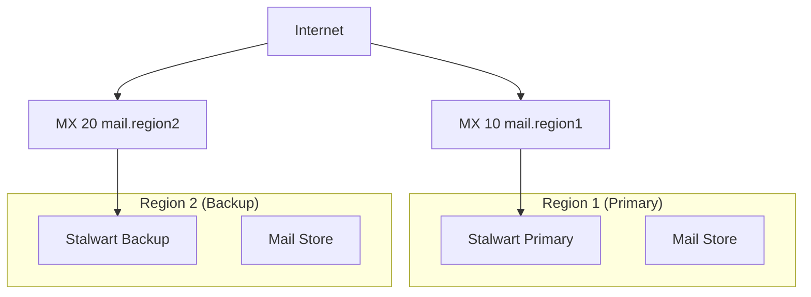

# ADR: Email Platform with Stalwart

**Status:** Accepted
**Date:** 2024-07-01
**Updated:** 2026-01-16

## Context

Need email capability for transactional emails and notifications.

## Decision

Use **Stalwart** as self-hosted email server with multi-region considerations.

## Architecture



## Rationale

| Option | Cost | Protocols | Self-Hosted |
|--------|------|-----------|-------------|
| Cloud email (SES) | $$/volume | SMTP only | No |
| Postfix/Dovecot | $0 | SMTP/IMAP | Complex |
| **Stalwart** | $0 | JMAP/IMAP/SMTP | Simple | **Selected** |

**Key Decision Factors:**
- Modern JMAP protocol support
- All-in-one (MTA + MDA + webmail)
- Rust-based (low resources)
- Easy Kubernetes deployment

## Features

| Feature | Support |
|---------|---------|
| SMTP (sending) | Yes |
| IMAP (mailboxes) | Yes |
| JMAP (modern API) | Yes |
| Spam filtering | Yes (SpamAssassin compatible) |
| DKIM signing | Yes |
| Rate limiting | Yes |

## Configuration

```yaml
apiVersion: apps/v1
kind: Deployment
metadata:
  name: stalwart
  namespace: workplace
spec:
  replicas: 1
  template:
    spec:
      containers:
        - name: stalwart
          image: stalwartlabs/mail-server:latest
          ports:
            - containerPort: 25    # SMTP
            - containerPort: 587   # Submission
            - containerPort: 993   # IMAPS
            - containerPort: 8080  # JMAP/Webmail
          volumeMounts:
            - name: data
              mountPath: /opt/stalwart-mail
          env:
            - name: STALWART_ADMIN_PASSWORD
              valueFrom:
                secretKeyRef:
                  name: stalwart-credentials
                  key: admin-password
```

## DNS Requirements

| Record | Type | Value |
|--------|------|-------|
| `mail.<domain>` | A | <node-ip> |
| `<domain>` | MX | mail.<domain> |
| `<domain>` | TXT | `v=spf1 mx ~all` |
| `default._domainkey.<domain>` | TXT | DKIM public key |
| `_dmarc.<domain>` | TXT | `v=DMARC1; p=quarantine` |

## Multi-Region Considerations



Email DR strategy:
- Primary region handles mail (MX priority 10)
- Backup region as secondary MX (MX priority 20)
- Mail store backed up via Velero to Archival S3

**Note:** Email is typically region-specific. Full multi-region active-active email is complex and not recommended.

## Consequences

**Positive:**
- Self-hosted (control)
- Modern protocols (JMAP)
- Low resources
- All-in-one

**Negative:**
- Email deliverability management
- DNS complexity
- IP reputation management

## Related

- [ADR-EXTERNAL-DNS](../../external-dns/docs/ADR-EXTERNAL-DNS.md)
- [ADR-BACKUP](../../velero/docs/ADR-BACKUP.md)
